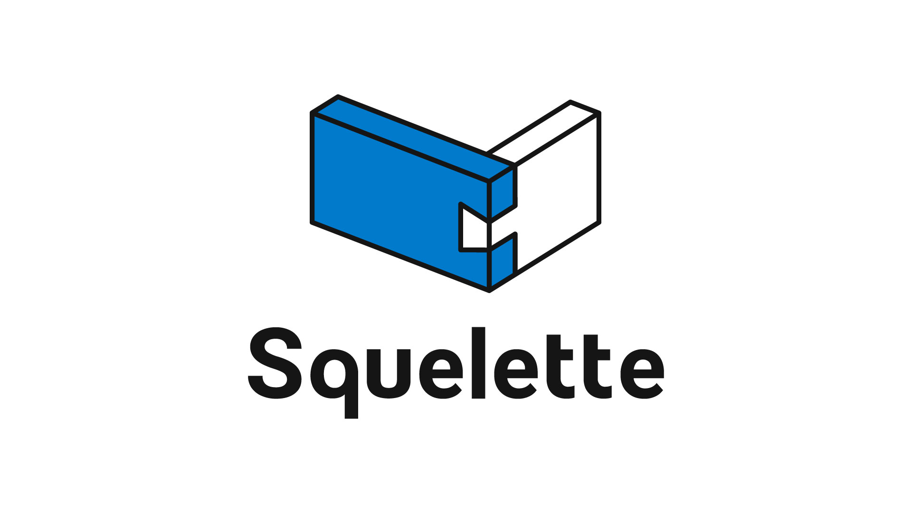

# Squelette
Squelette is a command line interface to enhance the usage of [Open API](https://www.openapis.org/) schema.

(Logo is designed by [@_pilecks](https://twitter.com/_pilecks) :sparkles:)

## Ecosystem

| Package | Versions | Description |
| --- | --- | --- |
| [@squelette/core](https://github.com/andoshin11/squelette/blob/master/packages/squelette-core/README.md) |  | Provides Open API parser and basic types. |
| [@squelette/ts-gen](https://github.com/andoshin11/squelette/blob/master/packages/squelette-ts-gen/README.md) |  | Generates type definitions both for component schemas and operation request/response. |
| [@squelette/request-gen](https://github.com/andoshin11/squelette/blob/master/packages/squelette-request-gen/README.md) |  | Generates API request hints for each operations. |
| [@squelette/url-gen](https://github.com/andoshin11/squelette/blob/master/packages/squelette-url-gen/README.md) |  | Generates URL hints and factory functions for each operations. |

## License
MIT
